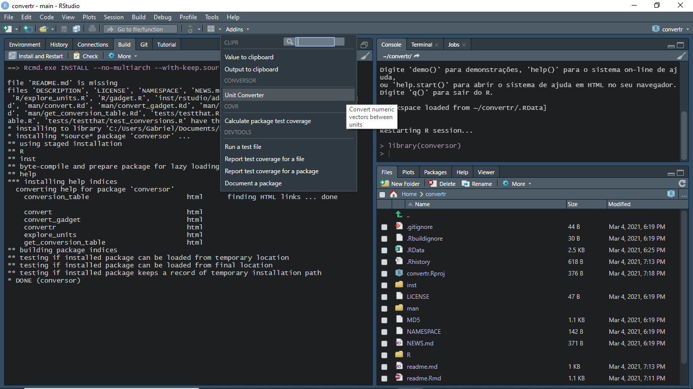
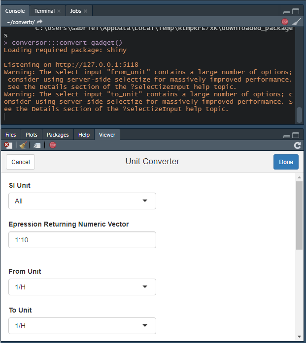

## Instalacao

Baixe o pacote com: 
```{r, eval=FALSE}
install.packages("devtools")
install.packages("shiny")
devtools::install_github("GShotwell/convertr")
```


## Uso

O pacote contém uma função que converte vetores numéricos de uma unidade para outra. Os dados sobre os fatores de conversão vêm do Dicionário de Unidades de Medida POSC v2.2 e da Wikipedia.

As unidades são convertidas usando uma tabela de pesquisa, com base no dicionário POSC. Você pode explorar esta tabela usando a função explore_units (). Esta função inicia um aplicativo brilhante.

Descobrir quais unidades podem ser convertidas entre si pode ser complicado, então convertr vem com um gadget brilhante para ajudá-lo a construir expressões convert () válidas. Isso pode ser acessado chamando convert_gadget () ou através do menu addin. Para acessar o addin, certifique-se de estar usando uma versão recente do RStudio.

## Exemplo
```{r}

```



## Creditos 

```{r, eval=FALSE}
https://github.com/cran/convertr
```
